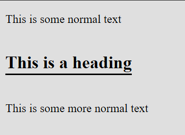

# Text Width Horizontal Rule

Often times, you want to create a horizontal rule that spans the width of the text. This is a simple way to do that.

```css
.hr {
    display: inline-block;
}

.hr::after {
    content: '';
    display: block;
    border-top: 2px solid black;
    margin-top: .1rem;
}
```

In the above snippet we create a horizontal rule that spans the width of the text. We do this by creating a block element with `display: inline-block` and then adding a pseudo element with `display: block` and a border. The `margin-top` is used to create some space between the text and the horizontal rule.

This is how it looks:

```html
<p>
    This is some normal text
</p>
<h2 class="hr">This is a heading</h2>
<p>
    This is some more normal text
</p>
```

Which will render as:

